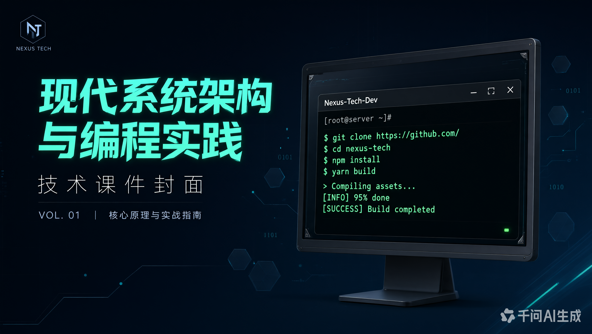
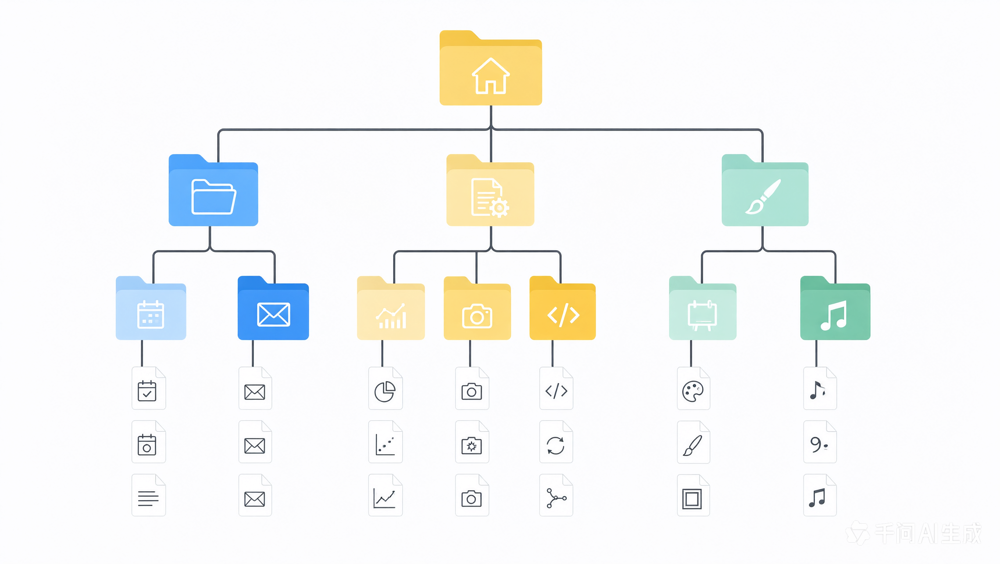
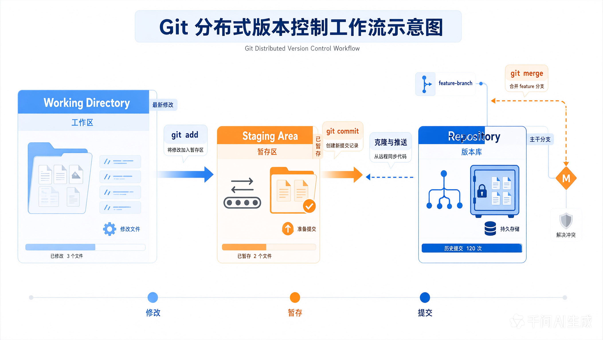

# 计算机命令操作基础与 Git 操作笔记

> 学习日期：2026-08-12
> 学习主题：命令行操作基础 + Git 版本控制
> 学习目标：掌握常用终端命令，能够使用 Git 完成项目的版本管理。

---

## 一、计算机命令操作基础

### 1.1 什么是命令行界面（CLI）

命令行界面（Command Line Interface，**CLI**）是通过文本指令与计算机交互的方式。与图形界面（GUI）相比，它**更高效、可脚本化、占用资源少**，是开发者必备技能。



*图 1-1 现代终端命令行界面*

相关概念区分：

| 名称 | 说明 |
| --- | --- |
| **终端（Terminal）** | 输入输出设备的软件模拟，负责接收和显示字符 |
| **Shell** | 解释并执行命令的程序，如 Bash、PowerShell、Zsh |
| **控制台（Console）** | 系统直接交互的物理/虚拟终端 |

### 1.2 路径与目录

路径用于定位文件在文件系统中的位置，分为两类：

- **绝对路径**：从根目录开始的完整路径，例如 `D:\Trae\project\homework`
- **相对路径**：相对于当前工作目录的路径，例如 `./day01` 或 `../homework`



*图 1-2 目录树结构*

常用路径符号：

- `.` 表示当前目录
- `..` 表示上一级目录
- `~` 表示用户主目录（Linux/macOS）
- `/` 或 `\` 为路径分隔符

### 1.3 常用命令对照表

Windows（PowerShell）与 Linux/macOS（Bash）常用命令对照：

| 功能 | Windows (PowerShell) | Linux / macOS (Bash) | 说明 |
| --- | --- | --- | --- |
| 查看当前目录 | `Get-Location` | `pwd` | 显示工作目录绝对路径 |
| 列出文件 | `Get-ChildItem` (`ls`) | `ls` | 列出目录内容 |
| 切换目录 | `Set-Location` (`cd`) | `cd` | 进入指定目录 |
| 创建目录 | `New-Item -ItemType Directory` | `mkdir` | 新建文件夹 |
| 删除文件 | `Remove-Item` | `rm` | 删除文件或目录 |
| 复制文件 | `Copy-Item` | `cp` | 复制文件 |
| 移动/重命名 | `Move-Item` | `mv` | 移动或重命名 |
| 查看文件内容 | `Get-Content` | `cat` | 输出文件内容 |
| 清屏 | `Clear-Host` (`cls`) | `clear` | 清空终端显示 |

### 1.4 命令示例

**目录操作示例：**

```bash
# 切换到 homework 目录
cd D:/Trae/project/假期培训/homework

# 创建 day02 文件夹
mkdir day02

# 进入 day02 并查看内容
cd day02 && ls -la
```

**PowerShell 示例：**

```powershell
# 查看当前路径
Get-Location

# 列出当前目录所有文件（含隐藏文件）
Get-ChildItem -Force

# 创建一个新文件
New-Item -Path "note.md" -ItemType File
```

> **小技巧**：使用 `Tab` 键可自动补全文件名和命令；按 `↑` / `↓` 可翻阅历史命令。

---

## 二、Git 版本控制

### 2.1 Git 简介

Git 是一个**分布式版本控制系统**，用于追踪文件变化、协同开发。它的核心优势：

- **分布式**：每个开发者都拥有完整仓库副本，离线可用
- **分支轻量**：分支创建/切换/合并非常快
- **数据完整**：使用 SHA-1 哈希校验，保证内容不可篡改



*图 2-1 Git 分布式工作流*

集中式 vs 分布式对比：

| 特性 | 集中式（如 SVN） | 分布式（如 Git） |
| --- | --- | --- |
| 仓库位置 | 单一中央服务器 | 每个开发者本地完整副本 |
| 离线提交 | 不支持 | 支持 |
| 分支成本 | 较高 | 极低 |
| 协作方式 | 必须连中央服务器 | 可本地自由操作 |

### 2.2 三个工作区域

Git 项目有三个重要的逻辑区域：

1. **工作区（Working Directory）**：你看到的、可编辑的目录文件
2. **暂存区（Staging Area / Index）**：通过 `git add` 暂存的待提交快照
3. **版本库（Repository）**：通过 `git commit` 持久化保存的提交历史

数据流向：

```
工作区  --git add-->  暂存区  --git commit-->  版本库  --git push-->  远程仓库
```

### 2.3 初始配置

首次使用 Git 需配置用户信息（**仅需一次**，全局生效）：

```bash
# 设置全局用户名和邮箱
git config --global user.name "Lerrenp"
git config --global user.email "your_email@example.com"

# 设置默认分支名为 main
git config --global init.defaultBranch main

# 查看所有配置
git config --list
```

### 2.4 基本工作流程

一个完整的本地提交流程：

```bash
# 1. 初始化仓库
git init

# 2. 查看文件状态
git status

# 3. 将文件加入暂存区
git add .              # 添加所有变更
git add README.md      # 只添加指定文件

# 4. 提交到版本库
git commit -m "feat: 初始化项目并添加 day02 笔记"

# 5. 查看提交历史
git log --oneline
```

**提交信息规范（推荐 Conventional Commits）：**

- `feat:` 新功能
- `fix:` 修复 bug
- `docs:` 文档变更
- `style:` 代码格式（不影响功能）
- `refactor:` 重构
- `chore:` 构建/工具变更

### 2.5 远程仓库操作

将本地仓库与远程仓库关联并推送：

```bash
# 添加远程仓库（origin 是远程名，可自定义）
git remote add origin https://github.com/Lerrenp/homework.git

# 查看已配置的远程
git remote -v

# 首次推送（-u 设置上游关联）
git push -u origin main

# 后续推送
git push

# 拉取远程更新
git pull
```

> **提示**：使用 `gh` CLI 可一步完成「创建远程仓库 + 关联 + 推送」：
> ```bash
> gh repo create homework --public --source=. --remote=origin --push
> ```

### 2.6 分支管理

分支是 Git 协作的核心能力：

```bash
# 查看分支
git branch                 # 查看本地分支
git branch -a              # 查看所有分支（含远程）

# 创建并切换分支
git checkout -b feature/day03
# 等价于（新版语法）
git switch -c feature/day03

# 切换回主分支
git switch main

# 合并分支（将 feature 合并到 main）
git merge feature/day03

# 删除已合并的分支
git branch -d feature/day03
```

### 2.7 常见场景速查

- **撤销工作区修改**：`git checkout -- <file>`
- **撤销暂存（已 add 未 commit）**：`git reset HEAD <file>`
- **修改最近一次提交**：`git commit --amend`
- **查看差异**：`git diff`（工作区 vs 暂存区）
- **暂存未完成工作**：`git stash` / 恢复 `git stash pop`

### 2.8 .gitignore 文件

用于忽略不需要纳入版本控制的文件，例如：

```gitignore
# 操作系统文件
Thumbs.db
.DS_Store

# 编辑器缓存
.vscode/
.idea/

# 依赖目录
node_modules/

# 日志与临时文件
*.log
*.tmp
```

---

## 三、知识小结

### 3.1 命令行核心要点

- 熟记 `cd`、`ls`、`mkdir`、`rm` 等基础命令
- 理解绝对路径与相对路径的区别
- 善用 `Tab` 补全与历史命令提升效率

### 3.2 Git 核心要点

- **三大区域**：工作区 → 暂存区 → 版本库
- **基本流程**：`init` → `add` → `commit` → `push`
- **协作关键**：分支 + 远程仓库
- **好习惯**：写清晰的提交信息、合理使用 `.gitignore`

### 3.3 学习建议

1. 多动手实践，命令是「练」出来的，不是「背」出来的
2. 在真实项目中使用 Git 管理代码，体会版本回退与分支协作
3. 遇到问题先 `git status` 和 `git log`，再决定下一步操作

---

## 参考资料

- [Pro Git Book（中文版）](https://git-scm.com/book/zh/v2)
- [GitHub Docs](https://docs.github.com/)
- [PowerShell 官方文档](https://learn.microsoft.com/powershell/)

---

*本笔记由 mjl 整理 · 持续更新中*
